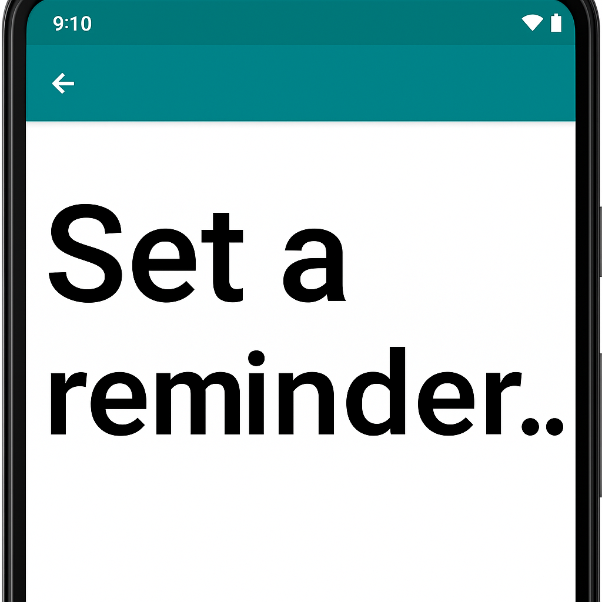
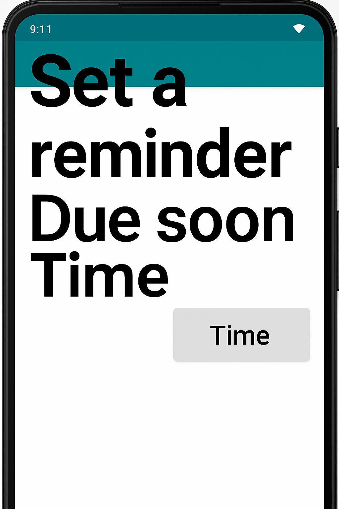
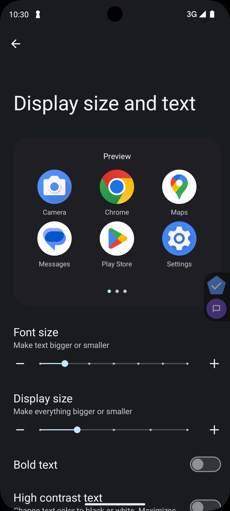

[Font scaling](https://support.google.com/accessibility/android/answer/12159181?hl=en) — or large text size — is one of the most widely used accessibility features on mobile. It allows users to increase text size system-wide, which is critical for those with low vision or who prefer larger fonts. In fact, **around 20% of mobile users use a font scale above the default**, making this a crucial consideration for Android developers.

In this post, we’ll cover how to support font scaling *well* in Android apps, highlight common issues like clipping and overlapping, and walk through practical testing strategies to prevent regressions.

## Enabling font scaling

Enabling font scaling in your Android apps is quite simple (and it’s likely you already support it!). All that needs to be done is to ensure that the text in your application is sized in `sp` units. `sp` units are [scalable pixels](https://developer.android.com/design/ui/mobile/guides/layout-and-content/grids-and-units#takeaways) and allow the font size to be scaled based on the user’s device font scaling settings. If, on the other hand, you size the text in your app using `dp` units (density independent pixels), the text in your app will not change size no matter what font scaling setting your users have set. Luckily for us Android developers, Android Studio provides ample lint warnings regarding the use of units other than `sp` for text, so if you’ve been following that advice, the text in your app will likely scale appropriately already. **This is not all there is to do however.** To support font scaling *well* within your application it is vital to ensure that the UI of your app is dynamic and handles increased text sizes in a predictable and easy to use way.

While font scaling can cause many types of unique issues in your app's UI, three tend to be the most common in my experience. Those issues are text clipping, overlapping content and lacking scrolling.

## Text clipping



The first and most common issue that can occur due to font scaling is text clipping. This issue occurs when text is cutoff or truncated due to its size being increased and it running out of space to be displayed. A few situations where this issue often happens is when a text element is limited to a fixed number of lines or the text element has a fixed size.

Resolving this issue is usually simple on its own (e.g. increasing or removing the line limit or making the width/height of the text element dynamic). However, complexity can arise when these changes impact the other UI displayed in your app. In many cases content will be rearranged due to the large font scale and you must ensure this rearrangement works well on the screen as a whole. If you are working with designers, it’s a good idea to show them how the screen will look under the largest font scaling settings once you have ensured the text clipping issues are resolved.

## Overlapping content



Another frequent problem caused by font scaling is **overlapping content** — especially in horizontal layouts. When two pieces of content are laid out horizontally next to each other, it is very common for them to experience overlapping when large font scaling is enabled on the device. As this type of layout is extremely common in mobile apps (e.g. side-by-side buttons, list items, etc), this is a problem that we should be sure to avoid.

Unlike the text clipping solutions, there isn’t an easy property update we can make to resolve overlapping content issues. The best resolution for overlapping content is to swap the content from being laid out horizontally (side-by-side) to being laid out vertically (content on top of each other). One library that can help with this is [Flexbox Layout from Google](https://github.com/google/flexbox-layout), however you can also build something more lightweight for this specific case by creating a custom layout.

## Lack of scrolling

This final issue can occur on screens that normally do not need to scroll as the content displayed on them *always* fits within the screen. This assumption could be true at the default font scale (you did make sure to test on small devices right?), however when users increase their font scaling setting situations where the content exceeds the viewport size of their device can happen easily. 

Fortunately, this issue is generally straightforward to resolve. Wrapping all of the content in your screen within a scrollable component like a `Column` or `ScrollView` will resolve this issue and have no negative impact for the default font scale case. These components only show scrolling when the content height exceeds the screen.

## Testing

Now that we’re aware of the top issues to watch out for regarding font scaling, it’s important we know how to test for them in our apps and prevent future regressions after we fix them.

Snapshot tests are a great way to find font scaling issues and they can help you ensure regressions aren’t introduced in the future! These types of tests work by taking a screenshot of your apps UI in a particular state and recording that as an image file that is checked into your repository. When you run the test again, the test will check whether or not the generated snapshot is different from the snapshot that was previously stored and fail the test if so. You can simulate font scaling in your snapshot tests to visualize how your UI will behave under various scaling settings. [Paparazzi](https://github.com/cashapp/paparazzi) is one of many Android snapshot test libraries that you could use to do this. Below is a code snippet showing how to set up large font scaling (2x scale in this case) in a Paparazzi test. 

```kotlin
@get:Rule
val paparazzi = Paparazzi(
  theme = "Theme.Cash.Default.Accent",
  deviceConfig = DeviceConfig.PIXEL_2.copy(fontScale = 2.0f),
)
```

Finally, it is always good to try out your app on your own device with various font scaling settings to see how it behaves. While this type of manual testing is time intensive, it can showcase issues that might have been missed in your automated snapshot testing. To change the font scaling setting on your device you can find the options in the accessibility menu in your device’s settings app. Shown below is what the setting looks like on a recent pixel device, however it may appear differently on your device. 



Page in accessibility settings on a Pixel 8 showing font size controls

Now that we know common issues to watch out for and how to find them within our apps, we are ready to go out there and ensure font scaling works for all of our users! Large font scaling is the most widely used accessibility setting and as a result is one of the highest leverage fixes you can make to your apps to ensure they are accessible for everyone. Happy font scaling!